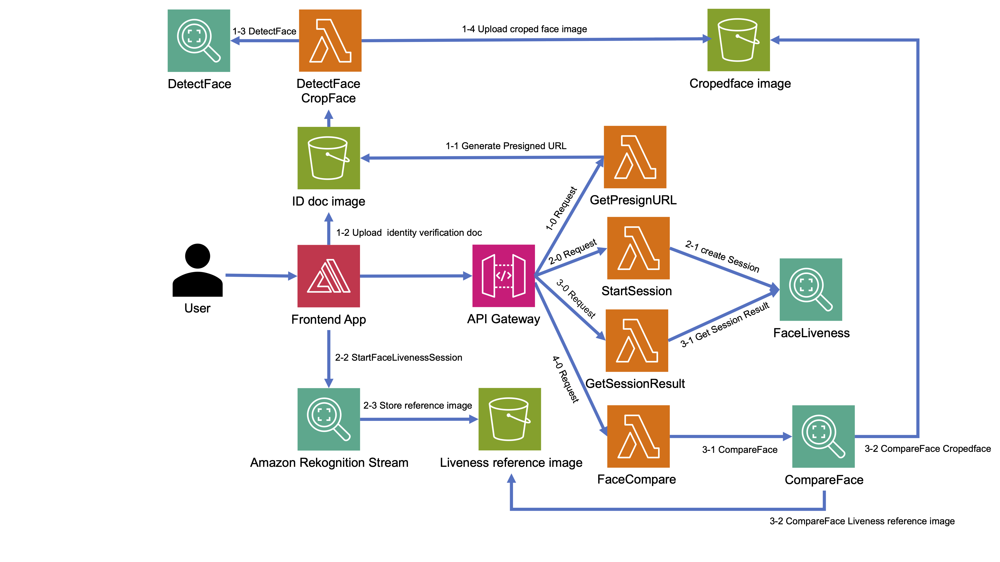

# Amazon Rekognition オンライン身元確認

Amazon Rekognitionを使ったオンライン身元確認フローのサンプルコードです。

このフローでは、顔検出(DetectFace)、顔比較(CompareFace)、およびフェイスライブネス(Face Liveness)を利用して、数秒で実在するユーザーを検出し、身元確認書類の顔画像とユーザの顔が一致するかを確認することで、不正な偽造を防ぐことができます。

## アーキテクチャ



## コンポーネント
フェイスライブネスは以下の複数のコンポーネントを使用します。

* AWS Amplify SDKとFaceLivenessDetectorコンポーネント
* AWS SDK
* AWS Cloud API

## 前提条件

```sh
# AWS CLIのセットアップ
aws configure
```

ローカル環境にインストールするには、以下の手順が必要です。

1. [Docker](https://www.docker.com/ja-jp/)をローカルにインストールし、Docker Daemonを実行します。
1. 公式ドキュメンテーション[の説明](https://docs.aws.amazon.com/cdk/latest/guide/getting_started.html)に従ってAWS CDKをローカルにインストールします。
1. [AWSアカウントにCDKを初期化](https://github.com/aws/aws-cdk/blob/master/design/cdk-bootstrap.md)します。
1. [python.org](http://python.org/)からPython 3.6以降をインストールします。
1. Pythonの仮想環境を作成します。
  ```sh
  python3 -m venv .venv
  ```

1. 仮想環境を有効化します。
  MacOSまたはLinuxの場合
  ```sh
  source .venv/bin/activate
  ```
  Windowsの場合
  ```sh
    .venv\Scripts\activate.bat
  ```

## ソリューションのデプロイ

[one-click.sh](https://github.com/aws-samples/amazon-rekognition-face-liveness/blob/main/one-click.sh)ユーティリティスクリプトは、AWSアカウントにRekognition Face Liveness(rfl)スタックをデプロイする推奨される手順です。依存関係のインストールやOut-Of-Band (OOB)操作の実行など、すべての手順を自動化します。さらに、既存の環境のアップグレードや、将来の要件への対応もサポートしています。

次の表は、上書き可能な環境変数を列挙したものです。このデプロイスクリプトは、同じアカウントおよびリージョン(例:us-east-1のProdとDev)に複数のスタックをデプロイすることをサポートしています。さらに、デフォルト設定では2億人の顔を一意に識別できます。これを超える場合は、rekognition-identity-verification@amazon.comまでご連絡ください。最後に、AWS CloudFormationではAmazon S3バケットとデプロイ先のリージョンが同じである必要があります。これらの値が異なる場合、*create-stack*コマンドは説明付きのエラーで失敗します。

```sh

# 同じリージョンに複数のインスタンスをデプロイすることができます(Prodとdev)
# この値を設定しない場合、デフォルトでは 'Rfl-Prod'になります。
# ランディングゾーン名の値を設定することで、この機能を制御できます。
export RFL_STACK_NAME=Rfl-Prod

# このコマンドを実行すると、依存関係(brew、yum、aptが必要な場合)がインストールされます。
# ローカルマシンの準備ができた後、環境にシンセサイズおよびデプロイされます。
./one-click.sh
```

## Amplifyアプリをローカルで実行するにはどうすればよいですか?
#まず、frontendディレクトリに.env.localファイルを作成し、以下の内容を記述します。

```
REACT_APP_ENV_API_URL=YOUR_API_GW_STAGE_URL
REACT_APP_IDENTITYPOOL_ID=AMAZON_COGNITO_IDENTITYPOOL_ID
REACT_APP_REGION=AMAZON_COGNITO_APP_REGION 
REACT_APP_USERPOOL_ID=AMAZON_COGNITO_APP_USERPOOL_ID
REACT_APP_WEBCLIENT_ID=AMAZON_COGNITO_APP_WEBCLIENT_ID
```

#依存関係をインストールしてアプリを起動します。

```
npm install
npm start
```

## コードの構成

- [infra](infra)。環境のプロビジョニングのためのCDK自動化
  - [cropface](infra/cropface/)。 身元確認書類の画像アップロード時にトリガーされる、顔検出と顔画像のクロップのバックエンド
  - [facelivenessbackend](infra/facelivenessbackend/)。RFLバックエンド
  - [frontend](infra/frontend/)。Amazon Rekognition Face LivenessのReactフロントエンドWebアプリのインフラ
- [src](src)。Lambdaファンクションやその他のコンピュートコンストラクトのバッキングコード
  - [liveness-session-result](src/backend/start-liveness-session/)。フェイスライブネスセッションを開始するバックエンド
  - [liveness-session-result](src/backend/liveness-session-result/)。フェイスライブネスセッション結果を取得するバックエンド  
  - [frontend](src/frontend)。Amazon Rekognition Face LivenessのReactフロントエンドWebアプリ